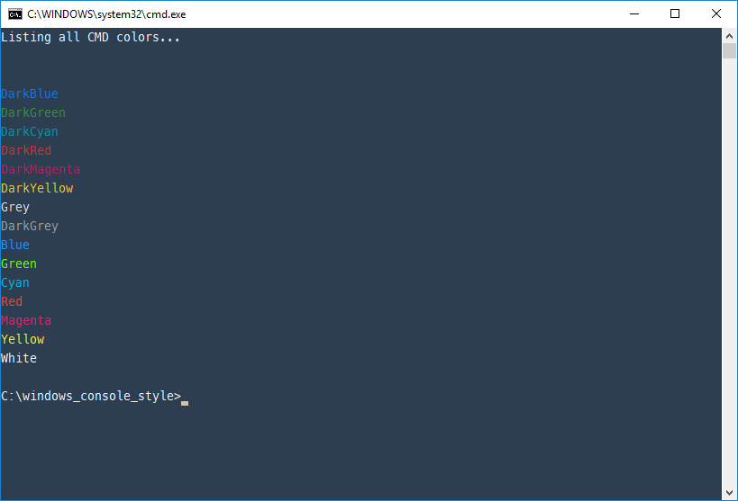
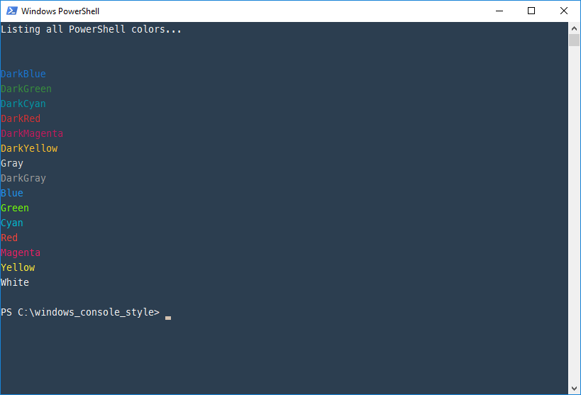

# Windows Console Style

Automatically style the windows consoles CMD and PowerShell.

## CMD

## PowerShell

## Installation

### Install Git

Install the latest version from:

* [Git](https://git-scm.com/downloads)

### Clone repository

Clone the [windows_console_style](https://github.com/countzero/windows_console_style) repository including its submodules to a nice place on your machine via:

    git clone --recurse-submodules https://github.com/countzero/windows_console_style.git

### Install Meslo Font

Install the `Meslo LG DZ` font from:

    ./vendor/Meslo-Font/dist/v1.2.1/Meslo LG DZ v1.2.1.zip

### Execute

Execute the [install.cmd](https://github.com/countzero/windows_console_style/blob/master/install.cmd).

## License
*Windows Console Style* is released under the [MIT license](https://opensource.org/licenses/MIT).
